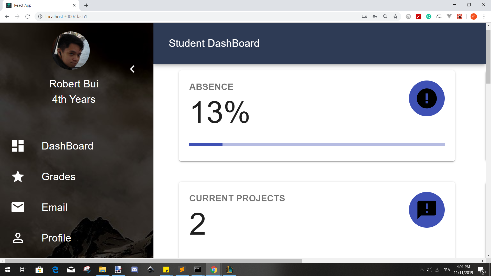

# Student Dashboard
# React Web App

## Introduction

Student dashboard is a modern and cleaner version of our current moodle. It is student-oriented and it can help you keep track on your school life. On this app, you can see multiple graphs about your grades and the others. You can also see graphs about your level of absence since the school applied a new rule : 6 hours of absence -> meeting with the campus director, 10 hours -> disciplinary board... You can also see the number of mails you had on the dashboard. We have implemented a mailing system too. You can access the website by using the following account : rbui@et.esiea.fr // password: 123soleil

## Technical Sheet

For the front part of the project, we decided to used the library Material-Ui, which is a React UI framework based on Google design. 
The only requirement of using this framework was to work with functionnal component for optimization reasons. 
For the navigation we used react-router-dom.
Concerning the website functionnality, it content most of informations of a classical student dashboard : 
The first page is a simple Login, using fetch to communicate with a Back-end data base.
The second page is the main page of the website, it contain 4 pages :
- A first page with multiples datas (Numbers of absence, Unread mail, Current project...) and also a graph and a radar chart.
- The second page is a summary of the student grades in a tables.
- The third page is Mail box of the student, containing a Drawer, and a list of mails.
- The last page is the profile page of the student, containing two box with multiples informations (Name, adress mail, pictures...)

For the backend, we used Node.JS and MongoAtlas. We decided to use Mongo Atlas to fix the issue of accessibility of the database. So when the teacher will try the project he won't have to install the database locally. 
On our database, we have two different collections. The student and the mail. Those collections have the same attributes as the object. We have also developed a few algorithms to make some calculations and several functionalities such as the tag system, the cryptography...

## Screenshots

As you can see, the website is responsive and can adapt to any device.

